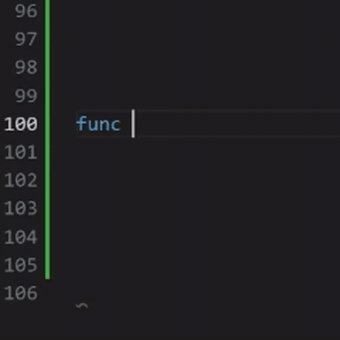
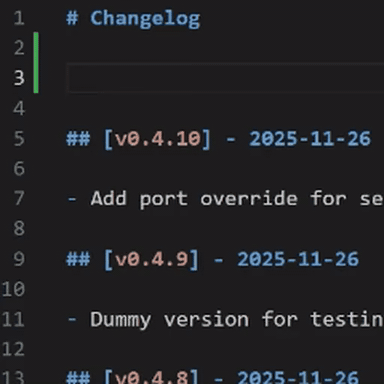
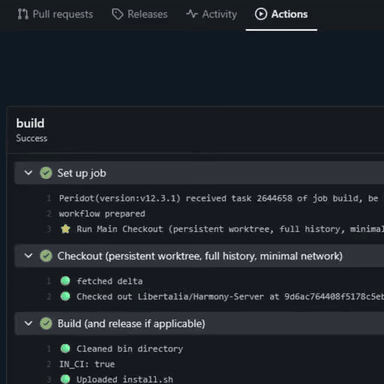
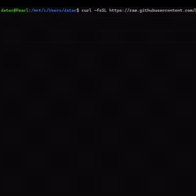
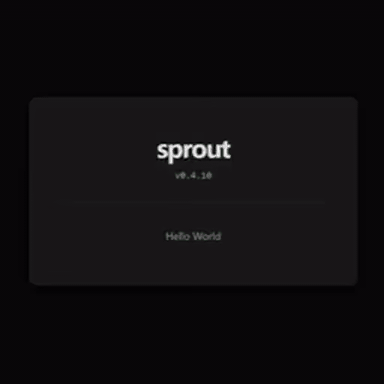
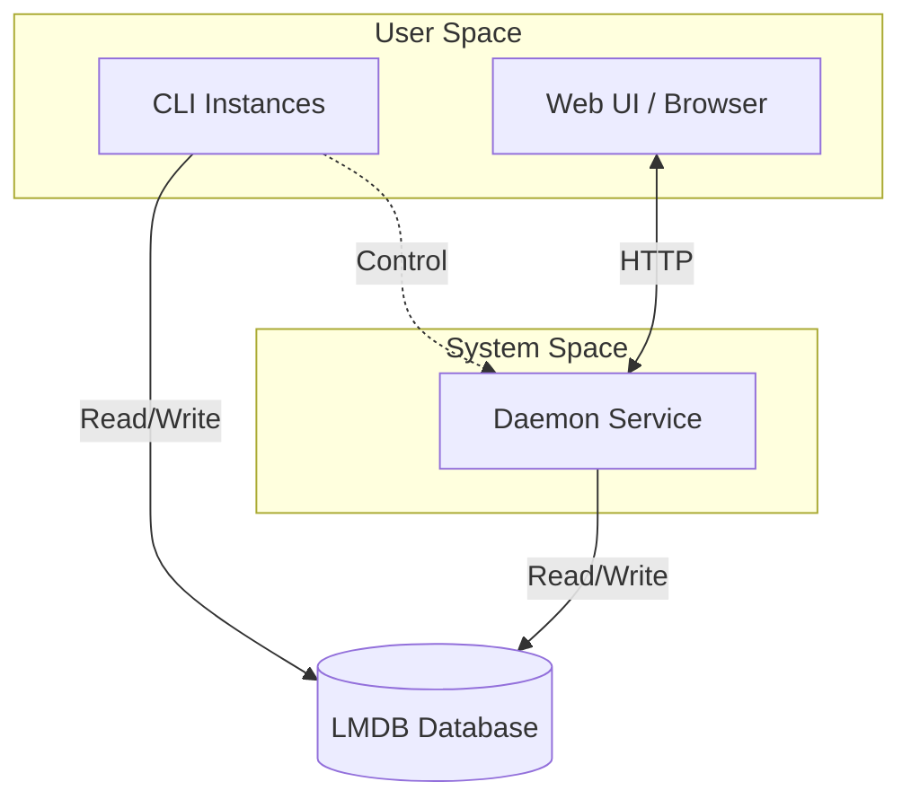

# 🌱 Sprout

**Go CLI/Daemon app template with atomic state, modern UI, built-in updates, and release plumbing.**

Sprout handles the *entire lifecycle* of a CLI application: compiling → packaging → publishing → installing → running (as a daemon) → and safely updating itself. Infrastructure that would take months to build from scratch, battle-tested and ready to use.

## Why Sprout?

Built with **love** and unhealthy amounts of caffeine. Sprout is a low-compromise solution for CLI/Daemon applications. Check this shit out:

- **How does the binary update without corrupting state?**: PID-tracked migration guards with cross-process file locking ensure safe, atomic updates even with multiple instances running.
- **How do multiple CLI instances + daemon share state?**: LMDB provides ACID-compliant, multi-process concurrent access that doubles as language-agnostic IPC.
- **How is releasing automated?**: Changelog-driven CI/CD. Push a version entry, and Github Actions builds fully static binaries, signs everything with cosign keyless signing, and uploads. The installer verifies the whole chain.
- **How does a systemd service update itself?**: Detached child process cosign-verifies the update script, then runs it: stops the service, downloads and verifies the new binary, and restarts it. Don't want self-update? The code is fenced into delete-to-disable blocks.
- **How is the dashboard secured?**: Always-on HTTPS (auto-generated self-signed cert, or plug in a reverse proxy), password login with Argon2id hashing, permission bitmask, rate limiting, and same-origin CSRF protection. `yourapp password add` and go.
- **How do you style the frontend?**: TailwindCSS + DaisyUI, all standalone (no npm needed) with compile-time cache busting... You'll be the belle of the ball.

## Workflow

| Edit Project | Create Release | Publish | Install | Update |
| :---: | :---: | :---: | :---: | :---: |
|  |  |  |  |  |
| Develop your app | Add a changelog entry | CI builds & uploads | One-liner install | Click-to-update in browser |

## Get Started

1. **[Use this Template](docs/DEVELOPMENT.md)** - Fork, configure, and build your own app
2. **[Installation Guide](docs/INSTALLATION.md)** - Template for end-user install docs

## Platform Support

Sprout is Linux-first. It targets `amd64` and `arm64`, and its daemon model depends on `systemd --user`.

| Platform | Status | Notes |
| :--- | :--- | :--- |
| **Linux** | Production | Primary target. Full CLI, daemon, install, and update flow. |
| **Windows** | Experimental | Includes a PowerShell installer that bootstraps WSL, installs Sprout inside it, and creates a Windows CLI shim. Service management still depends on WSL + `systemd --user`. |
| **macOS/BSD** | Unsupported | Lacks the `systemd` model Sprout is built around. |

## Architecture

Sprout uses **unified dependency injection**: the `App` struct holds all services (DB, Logger, Config, Server) and manages resource cleanup via a stack. For the full deep-dive, see [ARCHITECTURE.md](docs/ARCHITECTURE.md).

### Philosophy

*   **Complexity is the enemy.** If it's hard to understand, it will break, be hard to maintain, hard to debug, hard to update, etc.
*   **Dependencies should earn their keep.** Every external package is a liability. I try to only use them when they solve a non-trivial problem.
*   **Tackle the hard parts first.** Can't say this repo doesn't do that lmao.
*   **Write for humans.** Code is read more than it's written. In 6 months, you'll be the uninformed reader of your own code. Be kind to future you.
*   **Discipline.** Stop chasing hyperscale fantasies. Most software should remain small enough for individuals to understand, own, and repair.

This repo delivers a full CLI/Daemon lifecycle with **only a handful** of direct dependencies (plus a few official `golang.org/x/` packages). The ones that usually require npm (tailwindcss, daisyui) are automatically installed via their standalone methods by the build script, **no npm required**. All your users need is Linux or Windows, and a 64 bit machine.

 

🩵 xoxo :3 <- that last bit is a cat, his name is sebastian and he is ultra fancy. Like, i'm not kidding, more than you initially imagined while reading that. Pinky up, drinks tea... you have no idea. Crazy.

<!--
WHOA! secrets, secret messages, hidden level! https://youtu.be/zwZISypgA9M
-->